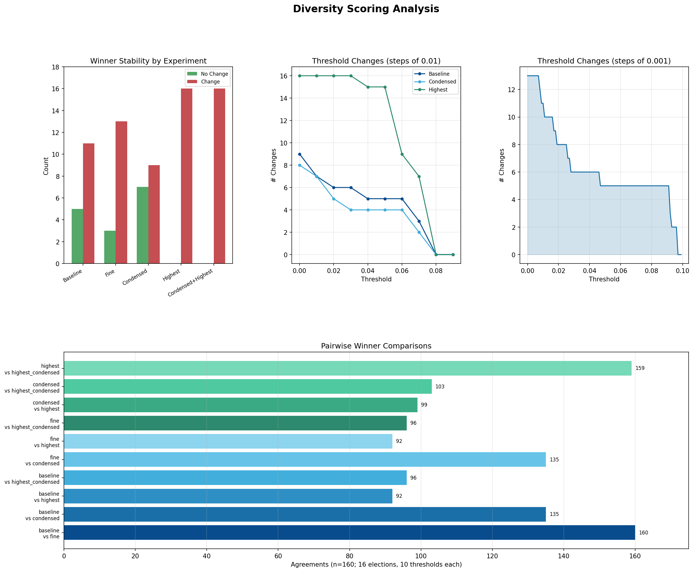

## Interpreting the findings


- Baseline: Diversity Scoring as described by Prof Maskin
- Fine: Same as baseline but increments of 0.001 (or 0.1 percent)
- Condensed: Similar to baseline but in a n-candidate election, omitting the last candidate in the ranking is equivalent to listing the last candidate. eg. ABC = AB in a 3 candidate election.
- Highest: Only one round of diversity scoring and picking winner with the highest score
- Condensed+Highest: First condensing the ballots then same procedure as highest.

### Graphs
- Winner stability by experiment: There are only a few cases where changing the threshold of when a ballot type is counted for the diversity score does not change the winner
- Threshold changes: Number of elections where there is a change in winner when threshold changes after x. Eg. For baseline, at 0.04, the number is 4. That means that 4 elections had winner changes after the threhold of 0.04 (eg. between 0.05-0.09, there was a change in winner).
- Pairwise Winner Comparisons: For 10 thresholds * 16 elections = 160 total observations, how often do the different methods described above agree with each other?

### Examples of ping-ping behaviour
Some examples of elections where candidate A is a winner at a lower threshold, then as the threshold increases, candidate B is the winner, then candidate Abecomes the winner again. These examples are from the regular diversity method.

```csv
,Unnamed: 0,file,threshold,winner,rounds,candsLeft,numCands
10,10,govan_govan.csv,0.0,# ALTERNATIVE NAME 6: Allison Hunter (SNP),10,2,11
11,11,govan_govan.csv,0.01,# ALTERNATIVE NAME 6: Allison Hunter (SNP),10,2,11
12,12,govan_govan.csv,0.02,# ALTERNATIVE NAME 6: Allison Hunter (SNP),10,2,11
13,13,govan_govan.csv,0.03,# ALTERNATIVE NAME 3: Stephen Dornan (Lab),9,3,11
14,14,govan_govan.csv,0.04,# ALTERNATIVE NAME 3: Stephen Dornan (Lab),9,3,11
15,15,govan_govan.csv,0.05,# ALTERNATIVE NAME 3: Stephen Dornan (Lab),9,3,11
16,16,govan_govan.csv,0.06,# ALTERNATIVE NAME 4: John Flanagan (Lab),9,3,11
17,17,govan_govan.csv,0.07,# ALTERNATIVE NAME 3: Stephen Dornan (Lab),10,2,11
18,18,govan_govan.csv,0.08,# ALTERNATIVE NAME 3: Stephen Dornan (Lab),10,2,11
19,19,govan_govan.csv,0.09,# ALTERNATIVE NAME 4: John Flanagan (Lab),10,2,11
```

```csv
,Unnamed: 0,file,threshold,winner,rounds,candsLeft,numCands
50,50,Ward2-KintyreandtheIslands_ward2.csv,0.0,John MCALPINE (Ind),5,2,6
51,51,Ward2-KintyreandtheIslands_ward2.csv,0.01,John MCALPINE (Ind),5,2,6
52,52,Ward2-KintyreandtheIslands_ward2.csv,0.02,Dougie MCFADZEAN (SNP),5,2,6
53,53,Ward2-KintyreandtheIslands_ward2.csv,0.03,Dougie MCFADZEAN (SNP),5,2,6
54,54,Ward2-KintyreandtheIslands_ward2.csv,0.04,Dougie MCFADZEAN (SNP),5,2,6
55,55,Ward2-KintyreandtheIslands_ward2.csv,0.05,John MCALPINE (Ind),5,2,6
56,56,Ward2-KintyreandtheIslands_ward2.csv,0.06,John MCALPINE (Ind),5,2,6
57,57,Ward2-KintyreandtheIslands_ward2.csv,0.07,John MCALPINE (Ind),5,2,6
58,58,Ward2-KintyreandtheIslands_ward2.csv,0.08,John MCALPINE (Ind),5,2,6
59,59,Ward2-KintyreandtheIslands_ward2.csv,0.09,John MCALPINE (Ind),5,2,6
```
```csv
,Unnamed: 0,file,threshold,winner,rounds,candsLeft,numCands
60,60,Minneapolis_11022021_CityCouncilWard2.csv,0.0,Cam Gordon,2,4,5
61,61,Minneapolis_11022021_CityCouncilWard2.csv,0.01,Robin Wonsley Worlobah,4,2,5
62,62,Minneapolis_11022021_CityCouncilWard2.csv,0.02,Cam Gordon,4,2,5
63,63,Minneapolis_11022021_CityCouncilWard2.csv,0.03,Cam Gordon,4,2,5
64,64,Minneapolis_11022021_CityCouncilWard2.csv,0.04,Robin Wonsley Worlobah,4,2,5
65,65,Minneapolis_11022021_CityCouncilWard2.csv,0.05,Robin Wonsley Worlobah,4,2,5
66,66,Minneapolis_11022021_CityCouncilWard2.csv,0.06,Yusra Arab,4,2,5
67,67,Minneapolis_11022021_CityCouncilWard2.csv,0.07,Robin Wonsley Worlobah,4,2,5
68,68,Minneapolis_11022021_CityCouncilWard2.csv,0.08,Robin Wonsley Worlobah,4,2,5
69,69,Minneapolis_11022021_CityCouncilWard2.csv,0.09,Yusra Arab,4,2,5
```